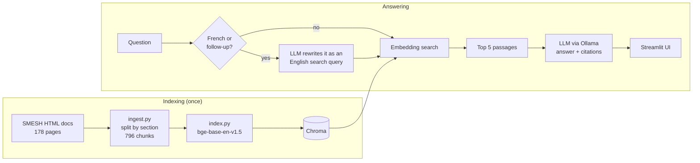

# SALOME Mesh Assistant

A local assistant that answers questions about meshing in
[SALOME](https://www.salome-platform.org/) (SMESH module), in the GUI or in Python,
and links each answer to the documentation it comes from.

It is a retrieval-augmented generation (RAG) pipeline that runs entirely on a laptop
CPU: no GPU, no API key, and questions never leave the machine.

Why this project: I work on SALOME meshing plugins during my apprenticeship at CEA,
and the documentation is large enough that finding the right page, or the right Python
call for a script, takes real time. An assistant that answers from the docs and shows
its sources would help me in my daily work, and could later help other engineers who
script SALOME, if it proves reliable enough. It is also how I chose to learn to build
and, above all, evaluate an LLM application properly.


Work in progress, see the [roadmap](#roadmap).

## Features

- Questions in English or French, e.g. "How do I merge nodes that are at the same
  location?" or "Comment exporter mon maillage au format MED ?"
- Answers are written by a local LLM from the retrieved passages only, with numbered
  citations that open the exact section of the docs.
- Follow-up questions ("and with a Python script?").
- Code snippets are checked: if a function used in the answer exists nowhere in the
  SMESH docs, a warning is shown under the answer.
- Model choice in the UI: `qwen2.5:7b` (default) or `qwen2.5:3b` (faster, less reliable).

## How it works



| Component | Choice | Reason |
|---|---|---|
| Chunking | By HTML section, max 1,500 characters, code blocks never split | Python examples stay whole |
| Embeddings | `BAAI/bge-base-en-v1.5` | Best retrieval scores on the eval set |
| Vector store | Chroma, local | No server to run |
| Reranking | Implemented, off by default | Made results worse with bge-base |
| Query rewriting | French and follow-up questions only | Helps in French, hurts in English |
| LLM | `qwen2.5:7b` through Ollama, temperature 0.1 | Fewer invented API calls than the 3B |

## Results

All numbers come from [`eval/RESULTS.md`](eval/RESULTS.md), which also lists the
configurations that did not work.

**Retrieval.** 27 questions, each labelled with the doc page(s) containing the answer.
hit@5 is the share of questions where a correct page is among the 5 passages given to
the LLM; MRR rewards ranking it first.

| Configuration | hit@1 | hit@5 | MRR | Search time |
|---|---|---|---|---|
| bge-small | 65 % | 81 % | 0.72 | < 0.1 s |
| bge-small + cross-encoder reranker | 65 % | 85 % | 0.74 | 13.3 s |
| bge-base + cross-encoder reranker | 62 % | 92 % | 0.75 | 14.6 s |
| bge-base (default) | 77 % | 92 % | 0.82 | 0.1 s |

This table was made with the first 26 questions. With the 27th (added after a bad
answer in the UI), the default configuration gives 74 % / 89 % / 0.79.

**French questions.** The same 27 questions, translated. The embedding model and the
docs are English-only, so the question is first rewritten in English by the LLM.

| | hit@1 | hit@5 | MRR |
|---|---|---|---|
| French question as is | 30 % | 52 % | 0.37 |
| Rewritten in English (default) | 52 % | 78 % | 0.62 |

**Answers.** `eval_answers.py` runs 8 questions end to end and checks the answers
automatically (format, and whether every called function exists in the docs).

| LLM (CPU) | Starts with a direct answer | No invented API call | Time / answer |
|---|---|---|---|
| qwen2.5:3b | 50 % | 75 % | ~1 min |
| qwen2.5:7b (default) | 100 % | 100 % | 35 s to 2 min |

### Notes

- The cross-encoder reranker helped bge-small but hurt bge-base, while being about 150
  times slower. It tended to push the large API reference pages above the user-guide
  page that actually answers the question.
- Measuring recall@20 early showed that most misses were ranking problems, not missing
  candidates, which changed what I tried next.
- LLM query rewriting broke three English answers: the 3B model does not know SALOME's
  vocabulary ("view the interior" never became "clipping"). In French it adds 26 points
  of hit@5, hence the automatic mode.
- A complete example answer in the prompt was copied word for word by the 3B model on an
  unrelated question. The prompt now only has an empty layout, and prompt changes are
  tested on several questions with `eval_answers.py`.
- My first hallucination check only compared function names with the 5 passages and
  flagged `MergeNodes`, which is a real function. It now checks against the whole docs.
- 27 questions is a small set: one question is about 4 points, so small differences
  are not meaningful.

## Running it

Tested on Ubuntu 22.04 (WSL2), Python 3.10, 16 GB RAM, no GPU.

```bash
git clone https://github.com/NicolasSaikaly/salome_assistant.git
cd salome_assistant
python3 -m venv .venv && source .venv/bin/activate
pip install torch --index-url https://download.pytorch.org/whl/cpu
pip install -r requirements.txt

curl -fsSL https://ollama.com/install.sh | sh
ollama pull qwen2.5:7b        # answers
ollama pull qwen2.5:3b        # query rewriting
```

The documentation is read from a SALOME installation (native package from
salome-platform.org):

```bash
DOCS_DIR=~/salome/SALOME-9.16.0-native-UB22.04-SRC/BINARIES-UB22.04/SMESH/share/doc/salome/gui/SMESH \
  python ingest.py            # -> data/chunks.jsonl
python index.py               # -> chroma_db/ (about 6 min on CPU)
python eval_retrieval.py      # retrieval metrics
python eval_answers.py        # answer checks (needs Ollama)
streamlit run app.py          # http://localhost:8501
```

From the command line: `python rag.py "How do I create a group of faces?"`
(add `--search` to only print the retrieved passages).

Settings can be changed through environment variables, for example `LLM_MODEL=qwen2.5:3b`,
`EMBED_MODEL=BAAI/bge-small-en-v1.5`, `RERANK=1`, `REWRITE=0` or
`QUESTIONS=eval/questions_fr.jsonl`.

## Files

```
ingest.py            HTML docs -> chunks
index.py             chunks -> embeddings -> Chroma
rag.py               search, query rewriting, answer generation, API call check
app.py               Streamlit UI
eval_retrieval.py    hit@1, hit@5, MRR, recall@20
eval_answers.py      checks on generated answers
eval/                question sets, results, saved answers
```

## Roadmap

- [x] Detect invented API calls in generated code
- [ ] Check the arguments of API calls, not only the names
- [ ] Run the generated scripts in SALOME and count how many execute
- [ ] Hybrid search (BM25 + embeddings) for exact names like `MergeNodes`
- [ ] Smaller chunks, to cut the time the LLM spends reading the passages
- [ ] A larger question set, with more scripting questions
- [ ] Other SALOME modules (GEOM, SHAPER)
- [ ] Unit tests and a CI job that fails if retrieval metrics drop

## Limitations

- Only the public SMESH documentation is indexed.
- When the right passage is not retrieved, the model can still answer off-topic; the
  citations are there so the user can check.
- On CPU an answer takes from about 35 s to 2 min, mostly spent reading the passages.

## Author

Nicolas Saikaly, engineering student in Computer Science and Applied Mathematics at
Polytech Paris-Saclay, apprentice software engineer on SALOME at CEA Paris-Saclay.
Personal project, built with public documentation only.

[LinkedIn](https://www.linkedin.com/in/nicolas-saikaly) / [GitHub](https://github.com/NicolasSaikaly)
