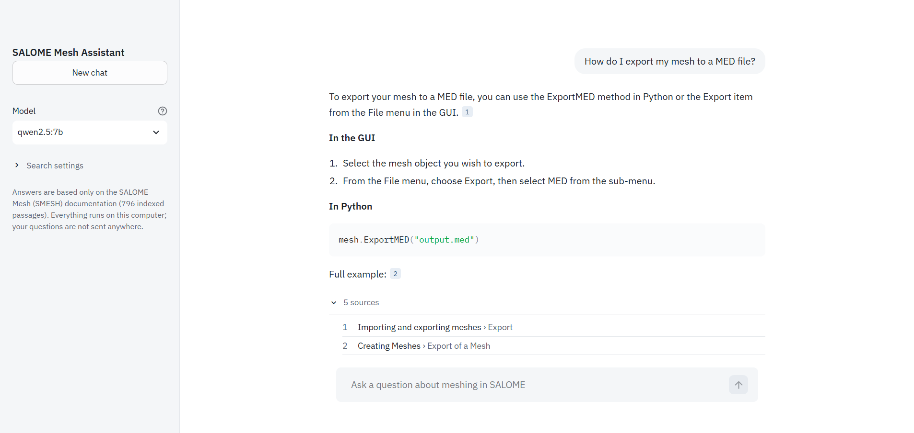
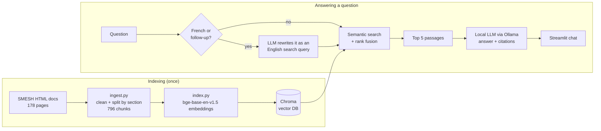

# SALOME Mesh Assistant

A local, open-source **RAG assistant** that answers questions about meshing in
[SALOME](https://www.salome-platform.org/) (the SMESH module) — in the GUI or with a
Python script — and **cites the documentation pages it used**.

Everything runs on a laptop CPU: no GPU, no API key, no data leaving the machine.
Every design choice below was made by **measuring it** on an evaluation set.



> **Status:** working prototype, actively developed — see [Roadmap](#roadmap).

---

## What it does

- Ask a question in plain English **or French**: *"How do I merge nodes that are at the
  same location?"*, *"Comment exporter mon maillage au format MED ?"*
- The assistant searches the SMESH documentation, then a local LLM writes an answer
  **grounded only in the passages found**, with clickable citations `[1]`, `[2]`
  pointing to the exact doc section.
- Follow-up questions work (*"and with a Python script?"*).
- Choose the model in the UI: `qwen2.5:7b` (default, more accurate) or `qwen2.5:3b`
  (twice as fast).
- **Guardrail**: every function used in a generated code snippet is checked against the
  documentation; if one exists nowhere in the docs, a warning is shown under the answer.

## How it works



| Step | Choice | Why |
|---|---|---|
| Chunking | Split by HTML section, max 1,500 chars, code examples never cut | Keeps each Python example whole so it can be quoted |
| Embeddings | `BAAI/bge-base-en-v1.5` | Best retrieval on the eval set (see below) |
| Vector store | Chroma (local, persistent) | Simple, no server |
| Reranking | Implemented, **off by default** | Measured: it hurt with bge-base |
| Query rewriting | Only for French / follow-up questions | Measured: helps French, hurts English |
| LLM | `qwen2.5:7b` via Ollama (3B optional), temperature 0.1 | Measured: the 7B invented no function on the test set, the 3B did in 2 answers out of 8 |

## Results

Retrieval is evaluated on **27 hand-written questions** (plus the same 27 in French),
each labelled with the doc page(s) that contain the answer.
Metrics: **hit@5** = the right page is among the 5 passages given to the LLM;
**MRR** = how high it is ranked (1.0 = always first). Full log: [`eval/RESULTS.md`](eval/RESULTS.md).

| Configuration | hit@1 | hit@5 | MRR | Search time |
|---|---|---|---|---|
| bge-small (baseline) | 65 % | 81 % | 0.72 | < 0.1 s |
| bge-small + cross-encoder reranker | 65 % | 85 % | 0.74 | 13.3 s |
| bge-base + cross-encoder reranker | 62 % | 92 % | 0.75 | 14.6 s |
| **bge-base, no reranker (default)** | **77 %** | **92 %** | **0.82** | **0.1 s** |

*(26-question set for this table; 27 questions after adding a real failure: 74 % / 89 % / 0.79.)*

**French questions** (embedding model and docs are English-only):

| | hit@1 | hit@5 | MRR |
|---|---|---|---|
| French question as is | 30 % | 52 % | 0.37 |
| **Rewritten in English by the LLM (default)** | **52 %** | **78 %** | **0.62** |

**Answer quality** (`eval_answers.py`, 8 questions, automatic checks):

| LLM (CPU) | Starts with a direct answer | No invented API call | Time / answer |
|---|---|---|---|
| qwen2.5:3b | 50 % | 75 % | ~1 min |
| **qwen2.5:7b (default)** | **100 %** | **100 %** | ~35 s to 2 min |

### What I learned

- **A stronger embedding model beat reranking.** The cross-encoder helped the small
  model but *hurt* the bigger one while being ~150× slower: it favoured large API
  reference pages over the user-guide page that answers the question.
- **Measure before optimizing.** Adding *recall@20* showed most failures were ranking
  problems, not missing candidates — which pointed to the right fix.
- **LLM query rewriting is not free.** On English questions the 3B model's rewrites
  broke three answers (it doesn't know SALOME's vocabulary, and my first prompt nudged
  it towards invented API names). On French questions it adds +26 points. Hence the
  *auto* mode.
- **Small models copy examples.** A full example answer in the prompt was reproduced
  word for word by the 3B model on an unrelated question; the prompt now uses an empty
  layout template, and every prompt change is checked on several questions.
- **Check the checker.** My first hallucination test flagged a real function
  (`MergeNodes`) because it only looked at the 5 passages given to the model.
- **Real failures become test cases.** A bad answer in the UI ("view the interior of
  a mesh" → clipping) was added to the eval set.
- **26 questions is small** (1 question ≈ 4 points): differences under ~8 points are
  not conclusive.

## Quick start

Tested on Ubuntu 22.04 (WSL2), Python 3.10, 16 GB RAM, CPU only.

```bash
git clone https://github.com/NicolasSaikaly/salome_assistant.git
cd salome_assistant
python3 -m venv .venv && source .venv/bin/activate
pip install torch --index-url https://download.pytorch.org/whl/cpu   # CPU-only PyTorch
pip install -r requirements.txt

# Local LLM
curl -fsSL https://ollama.com/install.sh | sh
ollama pull qwen2.5:7b        # answers
ollama pull qwen2.5:3b        # query rewriting (French / follow-up questions)
```

**Documentation source:** the HTML docs shipped with SALOME (download the native
package from salome-platform.org and extract it):

```bash
DOCS_DIR=~/salome/SALOME-9.16.0-native-UB22.04-SRC/BINARIES-UB22.04/SMESH/share/doc/salome/gui/SMESH \
  python ingest.py            # HTML -> data/chunks.jsonl
python index.py               # embeddings -> chroma_db/  (~6 min on CPU)
python eval_retrieval.py      # retrieval metrics
python eval_answers.py        # answer checks on 8 questions (needs Ollama)
streamlit run app.py          # web UI on http://localhost:8501
```

Command line: `python rag.py "How do I create a group of faces?"`
(`--search` to see the retrieved passages only).

Most settings can be changed without editing code, e.g.
`EMBED_MODEL=BAAI/bge-small-en-v1.5`, `RERANK=1`, `REWRITE=1|0|auto`,
`LLM_MODEL=qwen2.5:7b`, `QUESTIONS=eval/questions_fr.jsonl`.

## Project structure

```
ingest.py            HTML docs -> clean text chunks (sections, code blocks kept intact)
index.py             chunks -> embeddings -> Chroma
rag.py               retrieval (search, rank fusion, optional reranking, query rewriting)
                     + generation (prompt, streaming answer from Ollama)
app.py               Streamlit chat UI with clickable citations
eval_retrieval.py    hit@1, hit@5, MRR, recall@20 on a question set
eval_answers.py      automatic checks on generated answers (format, invented API calls)
eval/                questions.jsonl, questions_fr.jsonl, RESULTS.md
```

## Roadmap

- [x] Measure answer quality: detect invented API calls in generated code.
- [ ] Check the **arguments** of API calls too, not only the function names.
- [ ] **Run the generated scripts** in SALOME and report the share that executes.
- [ ] Hybrid search (BM25 + embeddings) for exact API names like `MergeNodes`.
- [ ] Larger eval set (50+ questions, more scripting questions).
- [ ] Other SALOME modules (GEOM, SHAPER) and a panel inside the SALOME GUI.
- [ ] Unit tests and a CI job that fails if retrieval metrics drop.

## Limitations

- Knows only the public SMESH documentation — nothing about other modules or
  in-house plugins.
- A 3B model can still answer off-topic or invent details when the right passage is
  not retrieved; the citations let the user check.
- CPU-only: an answer takes from ~35 s to ~2 min depending on the machine load, most
  of it spent reading the 5 passages.

## About

Built by **Nicolas Saikaly**, engineering student in Computer Science & Applied
Mathematics (Polytech Paris-Saclay) and software engineering apprentice working on
SALOME meshing plugins at CEA Paris-Saclay.
This is a personal project, built on my own machine from **public documentation only**.

[LinkedIn](https://www.linkedin.com/in/nicolas-saikaly) ·
[GitHub](https://github.com/NicolasSaikaly)
